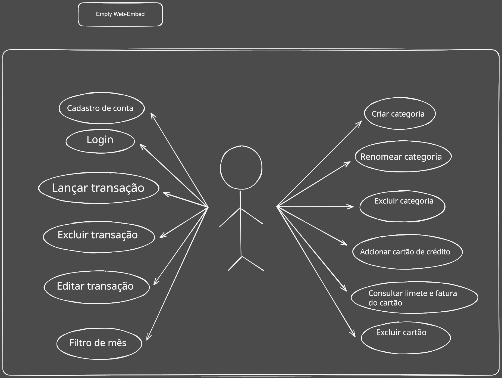

<div align="center">

# 💰 Dashboard Financeiro

Aplicativo mobile para acompanhar receitas, despesas, saldo e cartões em um único lugar.
Gerencie sua vida financeira com uma interface objetiva, segura e otimizada para Android, iOS e Web.

<!-- Substitua os marcadores abaixo pelos badges do repositório quando disponíveis. -->


</div>

## 📱 Demonstração

Adicione aqui as capturas de tela ou um GIF do aplicativo. A tabela abaixo mantém as imagens organizadas lado a lado no GitHub:

<div align="center">

| Dashboard | Transações | Cartões |
| :---: | :---: | :---: |
|  |  |  |

</div>

> 💡 Para adicionar um GIF, inclua o arquivo em `docs/screenshots/` e use ``.

## 🚀 Principais Recursos

- 🔐 Cadastro, login e logout com autenticação por token JWT.
- 💾 Persistência segura da sessão usando `expo-secure-store`.
- 📊 Dashboard mensal com saldo, receitas, despesas e transações recentes.
- 💸 Cadastro, edição, listagem e exclusão de transações.
- 🏷️ Criação, edição e exclusão de categorias de receitas e despesas.
- 💳 Cadastro e gerenciamento de cartões de crédito.
- 🧾 Pagamento de fatura com restauração do limite disponível.
- 📅 Filtro de dados por período e consulta de transações por data.
- 📱 Navegação por abas entre início, transações, perfil e cartões.
- 🌐 Execução multiplataforma em Android, iOS e Web.
- ⚡ Atualização automática dos dados após operações de inclusão, edição ou exclusão.

## 🛠️ Tecnologias

| Categoria | Tecnologias e bibliotecas |
| --- | --- |
| Plataforma | React Native `0.81`, Expo `54` e Expo Router `6` |
| Linguagem | TypeScript `5.9` |
| Interface | React `19`, React Native SVG, Expo Linear Gradient e Expo Image |
| Navegação | Expo Router e React Navigation Bottom Tabs |
| Requisições | Axios |
| Persistência segura | Expo Secure Store |
| Ícones e interação | Lucide React Native, Expo Vector Icons e Expo Haptics |
| Visualização | React Native Gifted Charts |
| Animações e gestos | React Native Reanimated, Gesture Handler e Worklets |
| Qualidade | ESLint, `eslint-config-expo` e Prettier Tailwind CSS plugin |

## 🔌 API

O aplicativo consome a API REST hospedada em:

```text
https://dashboard-financeiro-projeto-pi-bac.vercel.app/api
```

Após o login, o token retornado pela API é salvo no `expo-secure-store` e enviado automaticamente nas requisições protegidas:

```http
Authorization: Bearer <token>
```

### Rotas disponíveis

| Método | Rota | Descrição | Autenticação |
| :---: | --- | --- | :---: |
| `POST` | `/auth/register` | Cria uma nova conta com nome, e-mail e senha | Não |
| `POST` | `/auth/login` | Autentica o usuário e retorna o token de acesso | Não |
| `GET` | `/dashboard/resumo` | Retorna saldo, entradas e saídas do período informado | Sim |
| `GET` | `/transacoes` | Lista transações; aceita `data_inicio` e `data_fim` | Sim |
| `POST` | `/transacoes` | Cadastra uma receita ou despesa | Sim |
| `PUT` | `/transacoes/:id` | Atualiza uma transação existente | Sim |
| `DELETE` | `/transacoes/:id` | Exclui uma transação | Sim |
| `GET` | `/categorias` | Lista as categorias do usuário | Sim |
| `POST` | `/categorias` | Cria uma categoria com nome e tipo | Sim |
| `PUT` | `/categorias/:id` | Atualiza o nome de uma categoria | Sim |
| `DELETE` | `/categorias/:id` | Exclui uma categoria | Sim |
| `GET` | `/cartoes` | Lista os cartões cadastrados | Sim |
| `POST` | `/cartoes` | Cadastra um cartão de crédito | Sim |
| `POST` | `/cartoes/:id/pagar-fatura` | Paga a fatura e restaura o limite disponível | Sim |
| `DELETE` | `/cartoes/:id` | Remove um cartão | Sim |

O cliente também trata respostas `401`: remove a sessão armazenada e redireciona o usuário para a tela de login.


## Caso de uso - UML



---

## 💻 Como Executar o Projeto

### Pré-requisitos

- [Node.js](https://nodejs.org/) em uma versão LTS.
- npm, instalado junto com o Node.js.
- [Expo Go](https://expo.dev/go) em um dispositivo físico ou um emulador Android/iOS.
- Para emuladores: [Android Studio](https://developer.android.com/studio) ou Xcode no macOS.
- Acesso à API descrita na seção [API](#-api).

### Instalação

1. Clone o repositório:

   ```bash
   git clone https://github.com/SEU-USUARIO/dashboard-financeiro-react-native.git
   cd dashboard-financeiro-react-native
   ```

2. Instale as dependências:

   ```bash
   npm install
   ```

3. Inicie o servidor do Expo:

   ```bash
   npm start
   ```

4. Abra o aplicativo usando o QR Code no Expo Go ou escolha uma das opções:

   ```bash
   npm run android
   npm run ios
   npm run web
   ```

### Verificação de qualidade

Execute o lint antes de enviar alterações:

```bash
npm run lint
```

## 🤝 Como Contribuir

1. Faça um fork do projeto.
2. Crie uma branch para sua alteração:

   ```bash
   git checkout -b feat/minha-melhoria
   ```

3. Implemente a mudança e valide com `npm run lint`.
4. Faça um commit seguindo [Conventional Commits](https://www.conventionalcommits.org/pt-br/v1.0.0/).
5. Envie a branch e abra um Pull Request descrevendo o problema, a solução e como testar.

## 📝 Licença

Este projeto está distribuído sob a licença [MIT](LICENSE). Consulte o arquivo `LICENSE` para obter o texto completo.

---

<div align="center">
  Desenvolvido com React Native, Expo e TypeScript
</div>